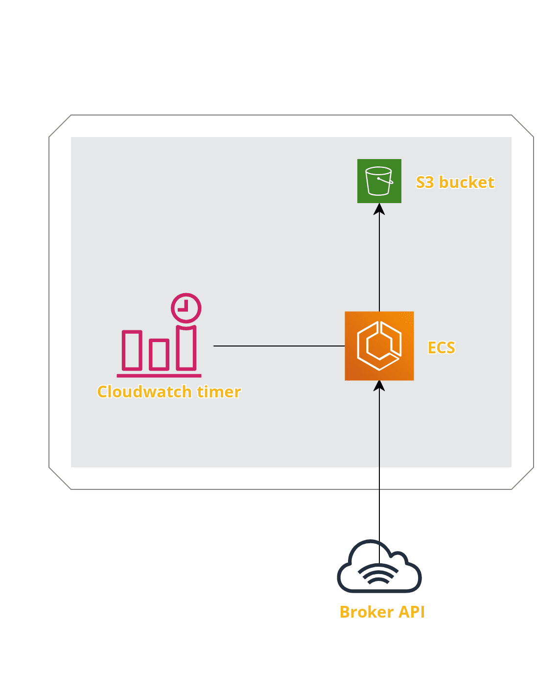

Design Doc: https://github.com/jgurtowski/tradestreamer/blob/master/project.org

Pull streaming quotes from tradier, compress with bzip2, push to s3

src/ - Clojure source code
infrastructure/ - aws infrastructure w/ cdk. deploy with npm run build && cdk deploy

Code pipelines uses the build.yml file in the root directory to build a docker image which is
stored in ECR. The image is triggered by a cloudwatch event every day at 9:15 via fargate.

The code uses clojure core.async quite heavily. This was not necessary per say, but was done to learn about the library -- given this is a small, self-contained project.